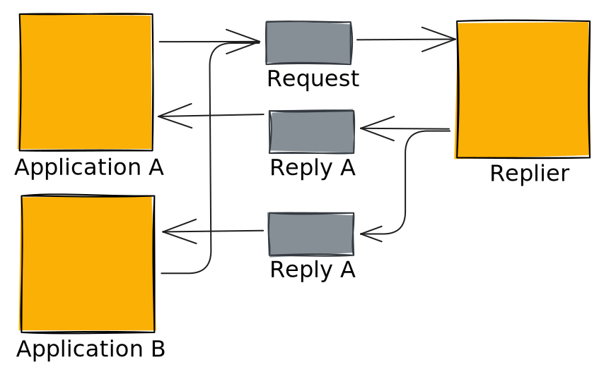

:blogpost:
   true

:date:
   2025-10-11

:tags:
   ASGI, Kafka

:category:
   python

###################################
 Magic Of The Callable Abstraction
###################################

Abstractions in programming are great!

If I want something to brew coffee, I can write a class ``CoffeeMachine`` with a method ``brew_coffee()``. Can then put
my coffee machine in a cafe, brew a coffee. If I want to swap out my coffee machine because the old one leaves weird
residue, I can do this. This is basically dependency injection.

This method though is very OOP.

If you wanted to add more steps to making a coffee, say frothing the milk, then adding cinnamon on top, you would have
to add this to your method of brewing.

This is where the callable abstraction comes in.

.. note::

   A function is callable so in this case they are synonymous

First we have a simple callable to brew coffee, it takes a request for coffee, and returns you a coffee:

.. literalinclude:: callable/coffee_example.py
   :start-after: # brew_coffee_start
   :end-before: # brew_coffee_end

Then we add a callable wrapper, this will take a callable that can brew coffee, then returns a new call that calls the
callable that brews a coffee, and then does another step... Adding Milk! (But only if you want it)

.. literalinclude:: callable/coffee_example.py
   :start-after: # add_milk_start
   :end-before: # add_milk_end

.. admonition:: Click to toggle
   :class: dropdown

   Callable wrapper, takes a callable, then makes a callable (which calls taken the callable), and returns the newly
   made callable.

   Say that ten times fast!

Then we have a cafe, this takes the callable that can brew a coffee, when asked to brew it will call the brew callable
which brews the coffee, and gives a coffee.

.. literalinclude:: callable/coffee_example.py
   :start-after: # cafe_start
   :end-before: # cafe_end

Now to use it, we have a cafe, which we give a brew callable, in this case the simple brew method wrapped in the ability
to add milk. Then when we ask the cafe to brew a coffee it adds the milk.

.. literalinclude:: callable/coffee_example.py
   :start-after: if __name__ == "__main__":
   :dedent:

**Yay!**

***********************
 Woah Way Too Abstract
***********************

Okay, now lets talk about a real world use-case: **HTTP**.

But first a short aside for a short history lesson.

Back in the days of the early internet there was CGI (:RFC:`3875`), or Common Gateway Interface. This allowed you to
write a executable in any language that could handle a HTTP request, all you needed was access to standard input/output,
and environment variables.

Here's a hello world:

.. literalinclude:: callable/cgi_example.sh

Set this up with any CGI compatible webserver, make a request, and boom working dynamic HTTP response handling.

But then in 2003 came WSGI (:PEP:`333`, updated :PEP:`3333`), or Web Server Gateway Interface. The advent (probably not)
of the callable abstraction. You define an application which is a callable that takes two arguments: ``environ`` (a
dictionary with request and server information) and ``start_response`` (a callable to set the HTTP status, and headers
that returns a ``write()`` callable). You can then return the body of the response by either calling the ``write()``
callable with bytes, or by the application callable returning an iterable of bytes.

The equivalent WSGI of the CGI would be:

.. literalinclude:: callable/wsgi_example.py
   :start-after: # simple_app_start
   :end-before: # simple_app_end

As an application is now just a callable you can wrap the callable so a new header is added to every request:

.. literalinclude:: callable/wsgi_example.py
   :start-after: # add_header_start
   :end-before: # add_header_end

You could then run the WSGI wrapped application using a WSGI compatible webserver:

.. literalinclude:: callable/wsgi_example.py
   :start-after: if __name__ == "__main__":
   :dedent:

Every response will now have the ``X-Powered-By`` header.

Finally we get in 2019 to ASGI_, or Asynchronous Server Gateway Interface. ASGI is a spiritual successor to WSGI,
intended to target some of its short comings, WSGI is inherently synchronous as it is a single synchronous callable, and
it does not allow for easy support of protocols like websockets, or HTTP long polling.

An ASGI application is a single asynchronous callable, it takes three arguments ``send`` which is a ``dict`` that
contains details about the specific connection, ``send`` an asynchronous callable which the application uses to send
messages, and ``receive`` an asynchronous callable that the application uses to receive messages.

The equivalent ASGI of the WSGI, and CGI would be:

.. literalinclude:: callable/main.py
   :start-after: # app_start
   :end-before: # app_end

You could then run the WSGI wrapped application using a ASGI compatible webserver such as uvicorn_:

.. literalinclude:: callable/main.py
   :start-after: if __name__ == "__main__":

Like WSGI, ASGI applications can be wrapped, allowing for simple middleware.

With this webservers can now process HTTP request **events**.

***************************
 Wait You Just Said Events
***************************

Yes I did, well observed!

This is where we get to the true magic.

**Question:** What if we took an ASGI application, and used it to handle events?

Receiving
=========

First things first, we need to do our boilerplate to receive events. Lets assume that we are going to use kafka_, so we
will reach for the aiokafka_ library. Then we will consume events, and handle them with the application:

.. literalinclude:: callable/kafka_01.py

Looking good, but it's not actually doing anything, we need to subscribe to something. But what does that mean in this
event-driven world. Well in the API world there is an idea of a path, and method which combined are your operation. So
we need to add some kind of mapping of topic to operation:

.. literalinclude:: callable/kafka_02.py
   :start-after: # start
   :end-before: # end

Here we take a mapping of topic, to operation. We use the mapping keys, or in this case topics to subscribe, and we pass
the operation object for the specific topic to the handle function.

Now we have to transform the record to a request for the application:

.. literalinclude:: callable/kafka_03.py
   :start-after: # start
   :end-before: # end

We first construct the scope dict:

:type:
   ``http``

:asgi:
   the version info for asgi

:http_version:
   ``1.1``

:method:
   comes from the passed in operation object

:path:
   also taken operation object

:query_string:
   left black but a required field

:headers:
   pulled directly from the record

Then we pass in a receive callable which return a dict:

:type:
   ``http.request``

:body:
   taken directly from the value of the record, but must be an emtpy byte array if ``None``

:more_body:
   ``False``, the record value is all of the body, so we indicate there will be no more

We can now connect to the Kafka broker, send a single message, and the application will be called. Great! So we've
wrapped the application so it doesn't have to implement access to Kafka.

This is starting to feel like an architectural pattern! It is, it's the:

.. epigraph::

   The Messaging Gateway encapsulates messaging-specific code (e.g., the code required to send or receive a message) and separates it from the rest of the application code. This way, only the Messaging Gateway code knows about the messaging system; the rest of the application code does not.

   -- `Enterprise Integration Patterns`_  (Hohpe and Woolf, 2003)

.. note::
   :class: dropdown

   Running Kafka

   You can run Kafka locally using the `apache/kafka`_ Docker image:

   .. code::

      docker run -d  \
        --name broker \
        -e KAFKA_NODE_ID=1 \
        -e KAFKA_PROCESS_ROLES=broker,controller \
        -e KAFKA_LISTENERS=PLAINTEXT://:9092,CONTROLLER://:9093 \
        -e KAFKA_ADVERTISED_LISTENERS=PLAINTEXT://localhost:9092 \
        -e KAFKA_CONTROLLER_LISTENER_NAMES=CONTROLLER \
        -e KAFKA_LISTENER_SECURITY_PROTOCOL_MAP=CONTROLLER:PLAINTEXT,PLAINTEXT:PLAINTEXT \
        -e KAFKA_CONTROLLER_QUORUM_VOTERS=1@localhost:9093 \
        -e KAFKA_OFFSETS_TOPIC_REPLICATION_FACTOR=1 \
        -e KAFKA_TRANSACTION_STATE_LOG_REPLICATION_FACTOR=1 \
        -e KAFKA_TRANSACTION_STATE_LOG_MIN_ISR=1 \
        -e KAFKA_GROUP_INITIAL_REBALANCE_DELAY_MS=0 \
        -e KAFKA_NUM_PARTITIONS=3 \
        apache/kafka:latest

Sending
=======

HTTP has a response, we need to handle that!

We will need a Kafka producer, so we will start that along with the consumer, and pass it to :py:func:`handle_record`:

.. literalinclude:: callable/kafka_04.py
   :start-after: # run_start
   :end-before: # run_end

In the handle record function we need to handle the running of the app, and our code to handle the send simultaneously.
We do this by passing in the app awaitable, and a new :py:func:`handle_send` to :py:func:`asyncio.gather`:

.. literalinclude:: callable/kafka_04.py
   :start-after: # handle_send_start
   :end-before: # handle_send_end

You'll notice we didn't actually decide where to send the response. For this we will pull a pattern out of the bag of
tricks that is `Enterprise Integration Patterns`_, in this case the `Return Address`_ pattern:

Basically you have a single topic (channel using the EIP naming), different applications can send to this channel, but
where does it send back. The way to deal with this is to include the return address in the request message. This has a
few advantages, firstly you are only processing responses to requests you made, and by separating the channels you can
add additional layers of security.

So how do we handle this in our record handler. Well the best place to put metadata is usually a header, so we will look
for the ``reply-to`` header, and use that, otherwise we drop the record, and move on:

.. literalinclude:: callable/kafka_05.py
   :start-after: # extract_reply_topic_from_headers_start
   :end-before: # extract_reply_topic_from_headers_end

Now we have to handle are sending. We modify the :py:class:`Send` class, this will keep a record of every message the
app sends, and add a new method :py:meth:`Send.get` to allow us to pull the messages received in :py:func:`handle_send`.

In the :py:func:`handle_send` we take the ``http.response.start``, and ``http.response.body`` messages to construct the
value, and headers to send to the ``reply_topic``:

.. literalinclude:: callable/kafka_05.py
   :start-after: # handle_send_start
   :end-before: # handle_send_end

:topic:
   this is the ``reply_topic`` we extracted before

:value:
   is the concatenation of all the body responses we get from the app

:headers:
   the headers are those we get from the app, plus we need to put the status code somewhere so this is added as a header

And that's it we now have a working ASGI server!

********************
 Things To Think On
********************

Excluding the fact that the Kafka AGSI server has no error handling, no dead-letters, no logging, and is limited to only
simple connection methods to Kafka (No auth!), this is quite cool right!

This is definitely a useful method, but it does come with a few considerations:

:Body Size:
   Given the transport medium is Kafka you will be limited to making requests that fit within the size of the record

:Get Method:
   The ``GET`` method is possible, but I would advise against it, there are far better architectural patterns to pull
   from

:Commands:
   Should you be using commands... sometimes yes, this will work well in those cases

:Paths:
   Paths are a thing. They can change. This example only supports a fixed path per topic. In HTTP you may have ``PUT
   /order/{id}`` to update an order, you could do some madness like having multiple topics/channels (This will work in
   some brokers), but for Kafka I would suggest mapping path parameters to headers.

:Query Strings:
   Can be handled by mapping them to headers, but as you're not going to use ``GET`` the use-cases are limited

:Mapping Pain:
   All that mapping from topic to operation was quite simple... when it was one endpoint. Write something that inspects
   the app in the framework of your choice to construct the mapping for you. operationId_ is a consept in most web
   frameworks, and could map directly to a topic name.

.. _aiokafka: https://aiokafka.readthedocs.io/en/stable/

.. _apache/kafka: https://hub.docker.com/r/apache/kafka/

.. _asgi: https://asgi.readthedocs.io/en/latest/index.html

.. _enterprise integration patterns: https://www.enterpriseintegrationpatterns.com/index.html

.. _kafka: https://kafka.apache.org/

.. _operationid: https://swagger.io/docs/specification/v3_0/paths-and-operations/#operationid

.. _return address: https://www.enterpriseintegrationpatterns.com/patterns/messaging/ReturnAddress.html

.. _uvicorn: https://uvicorn.dev/
