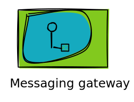

:blogpost:
   true

:date:
   2025-10-10

:author:
   Jack Burridge

:tags:
   ASGI, Kafka

:category:
   python

###################################
 Magic Of The Callable Abstraction
###################################

Abstractions in programming are great!

If I want something to brew coffee, I can write a class ``CoffeeMachine`` with a method ``brew_coffee()``. Can then put
my coffee machine in a cafe, brew a coffee. If I want to swap out my coffee machine because the old one leaves weird
residue, I can do this. This is basically dependency injection.

This method though is very OOP.

If you wanted to add more steps to making a coffee, say frothing the milk, then adding cinnamon on top, you would have
to add this to your method of brewing.

This is where the callable abstraction comes in.

.. note::

   A function is callable so in this case they are synonymous

First we have a simple callable to brew coffee, it takes a request for coffee, and returns you a coffee:

.. literalinclude:: callable/coffee_example.py
   :start-after: # brew_coffee_start
   :end-before: # brew_coffee_end

Then we add a callable wrapper, this will take a callable that can brew coffee, then returns a new call that calls the
callable that brews a coffee, and then does another step... Adding Milk! (But only if you want it)

.. literalinclude:: callable/coffee_example.py
   :start-after: # add_milk_start
   :end-before: # add_milk_end

.. admonition:: Click to toggle
   :class: dropdown

   Callable wrapper, takes a callable, then makes a callable (which calls the callable), and returns the callable.

   Say that ten times fast!

Then we have a cafe, this takes the callable that can brew a coffee, when asked to brew it will call the brew callable
which brews the coffee, and gives a coffee.

.. literalinclude:: callable/coffee_example.py
   :start-after: # cafe_start
   :end-before: # cafe_end

Now to use it, we have a cafe, which we give a brew callable, in this case the simple brew method wrapped in the ability
to add milk. Then when we ask the cafe to brew a coffee it adds the milk.

.. literalinclude:: callable/coffee_example.py
   :start-after: # using

**Yay!**

***********************
 Woah Way Too Abstract
***********************

Okay, now lets talk about a real world use-case: **HTTP**.

But first a short aside for a short history lesson.

Back in the days of the early internet there was CGI (:RFC:`3875`), or the Common Gateway Interface. This allowed you to
write a executable in any language that could handle a HTTP request, all you needed was access to standard input/output,
and environment variables.

Here's a hello world:

.. literalinclude:: callable/cgi_example.sh

Set this up with any CGI compatible webserver, make a request, and boom working dynamic HTTP response handling.

But then in 2003 came WSGI (:PEP:`333`, updated :PEP:`3333`), or Web Server Gateway Interface. The advent (probably not)
of the callable abstraction. You define an application which is a callable that takes two arguments: ``environ`` (a
dictionary with request and server information) and ``start_response`` (a callable to set the HTTP status, and headers
that returns a ``write()`` callable). You can then return the body of the response by either calling the ``write()``
callable with bytes, or by the application callable returning an iterable of bytes.

The equivalent WSGI of the CGI would be:

.. literalinclude:: callable/wsgi_example.py
   :start-after: # simple_app_start
   :end-before: # simple_app_end

As an application is now just a callable you can wrap the callable so a new header is added to every request:

.. literalinclude:: callable/wsgi_example.py
   :start-after: # add_header_start
   :end-before: # add_header_end

You could then run the WSGI wrapped application using a WSGI compatible webserver:

.. literalinclude:: callable/wsgi_example.py
   :start-after: # using

Every response will now have the ``X-Powered-By`` header.

Finally we get in 2019 to ASGI_, or the Asynchronous Server Gateway Interface. ASGI is a spiritual successor to WSGI,
intended to target some of its short comings, WSGI is inherently synchronous as it is a single synchronous callable, and
it does not allow for easy support of protocols like websockets, or HTTP long polling.

An ASGI application is a single asynchronous callable, it takes three arguments ``send`` which is a ``dict`` that
contains details about the specific connection, ``send`` an asynchronous callable which the application uses to send
messages, and ``receive`` an asynchronous callable that the application uses to receive messages.

The equivalent ASGI of the WSGI, and CGI would be:

.. literalinclude:: callable/asgi_example.py
   :start-after: # application_start
   :end-before: # application_end

You could then run the WSGI wrapped application using a ASGI compatible webserver such as ``uvicorn``:

.. literalinclude:: callable/asgi_example.py
   :start-after: # using

Like WSGI, ASGI applications can be wrapped, allowing for simple middleware.

With the webservers can now process HTTP request **events**.

***************************
 Wait You Just Said Events
***************************

Yes I did, well observed!

This is where we get to the true magic.

.. _asgi: https://asgi.readthedocs.io/en/latest/index.html

.. _enterprise integration patterns: https://www.enterpriseintegrationpatterns.com/index.html
