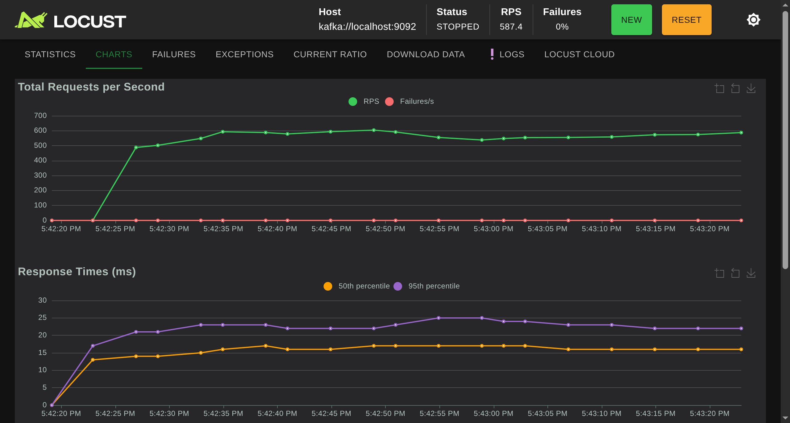
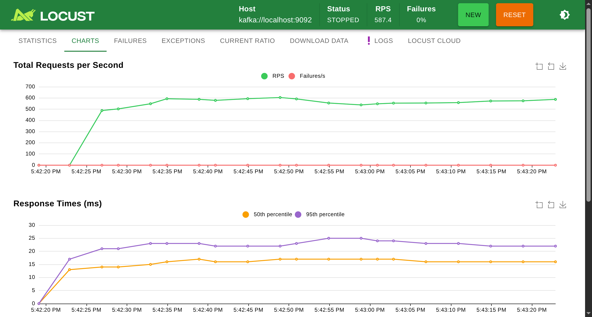

:blogpost:
   true

:date:
   2025-10-26

:tags:
   Kafka, Locust

:category:
   python

#####################################
 Significance Of Performance Testing
#####################################

Performance testing is a bit tricky. Some systems are hard to test, results are hard to interpret, and specific
workloads are hard to simulate.

I've had to run performance tests at every job I've ever had. Over the years I have come to some realisations:

.. list-table::
   :widths: 1 1
   :header-rows: 1

   -  -  Realisation
      -  Explanation

   -  -  Performance is about statistics, not simply numbers
      -  I can show you two averages, and because one is larger than the other, I’ve proved that the larger one is
         worse. This is not true! An average loses data, and that data has meaning.

   -  -  Performance testing is something the whole team should understand
      -  A team needs to be able to discuss results, and make correct decisions; if you are not talking the same
         language, you may argue, and misinterpret.

   -  -  Eventually, you will have to test *anything*

      -  There are plenty of tools for testing performance, but many of them focus on HTTP. Eventually you will have to
         test a database, binary protocol, or event-based system. My suggestion is use a tool that supports HTTP, but
         has the ability to be extended when needed later.

   -  -  Performance testing is not *optimisation*

      -  Often, when introducing performance testing, you will hear "Premature optimization is the root of all evil".
         While this statement is somewhat true, this is not what performance testing is for. Performance testing is
         there to **prove** that changes are truly optimisations, and to detect regressions.

   -  -  More often than not, performance is about cost
      -  While nice to have something **blazing-fast**, cost is usually the decider. If you can run something on two
         servers instead of ten, you pay less. The blazing-fast part is something you can boast about at conferences!

In this post I'll walk you through how to test an event-driven application, and how to interpret the results.

*******************
 System Under Test
*******************

To start we need an application to test. Here's one I made :ref:`earlier <best_header_you_probably_havent_heard_of>`:

.. literalinclude:: examples/fastapi_app_database.py
   :start-at: app = FastAPI()
   :end-before: if __name__ == "__main__":

I've made this little example using FastAPI_. It allows you to create orders. When it receives an order, it will save it
using the a Redis_ client. In this case we will be connecting to the Redis compatible NoSQL database called Kvrocks_,
which I will run in Docker_ using the following command:

.. code::

   docker run --name kvrocks --publish 6666:6666 --detach apache/kvrocks --bind 0.0.0.0

I also added the :ref:`EchoSetHeader <best_header_you_probably_havent_heard_of>` middleware, which we will use when
testing.

To run the application I use a Kafka_ ASGI server from my previous :ref:`post <magic_of_the_callable_abstraction>`:

.. literalinclude:: examples/fastapi_app_database.py
   :start-after: if __name__ == "__main__":
   :dedent:

As a quick refresher, this will connect to Kafka, and subscribe to the ``createOrder`` topic. Then process the request
in the app. Based on the ``reply-to`` header send with the request record, the ASGI server will send the response to the
requested reply topic. This is all following the `Return Address`_ pattern.

To run Kafka in Docker, I use the following Docker command:

.. code::

   docker run --name broker --publish 9092:9092 --detach apache/kafka-native

This is our system to test. As you've noticed its not HTTP, so next how will we test it?

*******************
 Writing The Tests
*******************

To write the tests, we will use the open source load testing tool Locust_, written with gevent_. Locust comes with
support for HTTP, and HTTPS, but can be extended to anything. Any client library that can be `monkey-patched
<monkey-patching>`_ by gevent can be used during a Locust tests, you simply wrap the client library, and trigger
:py:attr:`~locust.event.Events.request`. In our case, we will be using :py:meth:`~locust.event.EventHook.measure` for
convenience.

To write a test for Locust we need to write a ``locustfile.py``:

.. literalinclude:: examples/kafka_locustfile_01.py

A locust file is just a Python module, and can import code from other packages. In our case we will be using
``kafka-python`` to communicate with the Kafka broker. Here we define a user by writing a class that inherits from the
:py:class:`~locust.User` class. This class has a method to create orders that is decorated with :py:func:`@task
<locust.task>`.

The :py:meth:`create_order` will publish a record to the ``createOrder`` and :py:meth:`~locust.event.EventHook.measure`
the time taken for the request.

When Locust is run you specify the number of users, for each user it will create a greenlet_ (a coroutine), and will
call the decorated methods. Code within tasks are run sequentially meaning another task won't be run for a user until
the previous task has finished.

.. note::
   :class: dropdown

   I suggest a preference for using :py:func:`urllib.parse.urlparse` for parsing the host name, this allows you to use
   :RFC:`URIs <2396>` which can be extended to allow support for TLS, or username/password later.

Now we can run this test; you can simulate load:

.. code::

   locust

The problem is that we're only measuring the time taken to publish to Kafka. In our case, we want to measure the
round-trip time (RTT) for a request to go to one topic, and return on the reply topic.

To measure round-trip time, we need something listening on the reply topic. To do this we will need to modify the
locustfile:

.. literalinclude:: examples/kafka_locustfile_02.py

In this test we have modified the :py:meth:`create_order` task so that it sends a unique request id along with the
request. It will wait for that request id to end up in a message on the reply topic, using the ``x-reply-set-header`` to
achieve this. The task will wait a sensible timeout for a reply message, which in this case is 30 seconds.

.. note::
   :class: dropdown

   We have had to wrap the :py:class:`gevent.Timeout` exception as it is :py:class:`BaseException`, and will not be
   properly recorded by :py:meth:`~locust.event.EventHook.measure`

To listen for events we need to have a listener on the reply to topic. We set the listener running on test start with
:py:attr:`@events.test_start.add_listener <locust.event.Events.test_start>`, running the listener in the background
using :py:func:`gevent.spawn`. The listener gets attached to environment so that it can be used by the
:py:class:`OrdersUser` class.

The listener will consume messages from the reply topic, and where it sees the request id it will mark that response
message as being seen, by setting an :py:class:`~gevent.Event`. These events are stored in a
:py:class:`~weakref.WeakValueDictionary` so that memory is cleaned up effectively. For example, when the response times
out we don't want to keep the event in memory.

We can now run the test, and in the web UI, we will see some beautiful charts:

While this is useful, we can go one step further, by listening to the :py:attr:`@events.request.add_listener
<locust.event.Events.request>` event, we can optionally record every request response time in a CSV for further
analysis:

.. literalinclude:: examples/kafka_locustfile_03.py
   :start-after: # request_record_file_start
   :end-before: # request_record_file_end

*****************
 Making A Change
*****************

We now have the tests in place to allow us to test a change. In the original ``kafka2asgi`` record handling was in the
following loop:

.. literalinclude:: examples/kafka_05.py
   :start-after: # run_start
   :end-before: # run_end

Each record is consumed, and processed via our application. This is done serially, one record after another. I
hypothesize that the records could be processed faster if we were to call the application for each record in a separate
task. The modification for this would be:

.. literalinclude:: examples/kafka_06.py
   :start-after: # run_start
   :end-before: # run_end

We can now run Locust to record the original performance of the application using:

.. code::

   locust --headless --users 10 --spawn-rate 10 --requests-record-file baseline.csv --run-time 5m --host kafka://localhost:9092

Then we run the application with the modified ``kafka2asgi``, and run Locust against it with the same command:

.. code::

   locust --headless --users 10 --spawn-rate 10 --requests-record-file task_handler.csv --run-time 5m --host kafka://localhost:9092

Both tests run for the same amount of time of 5 minutes, have the same amount of 10 users, and record their requests to
CSV. These CSVs give us the data for analysis.

**************************
 Statistical Significance
**************************

.. include:: examples/comparison.ipynb
   :parser: myst_nb.docutils_

************
 What next?
************

You can now use these methods to test **anything**! You can run tests in CI to check that your performance isn’t
degrading, and you can validate your performance improvements.

This isn’t the end of the story; this was just a Load Test. To name a few other tests:

:Soak Test:
   Long running tests to detect issues like memory leaks

:Stress Test:
   To push the system beyond its breaking point, and see how it recovers

:Spike Test:
   To check how the system handles sudden increases in traffic

Locust_ also has support for distributed load testing allowing you to simulate millions of users! You can test for true
web-scale.

Explore, and see what is useful to you!

.. _docker: https://www.docker.com/

.. _fastapi: https://fastapi.tiangolo.com/

.. _gevent: https://www.gevent.org/

.. _greenlet: https://greenlet.readthedocs.io/en/stable/greenlet.html>

.. _kafka: https://kafka.apache.org/

.. _kvrocks: https://kvrocks.apache.org/

.. _locust: https://locust.io/

.. _monkey-patching: https://www.gevent.org/intro.html#monkey-patching

.. _redis: https://redis.io/

.. _return address: https://www.enterpriseintegrationpatterns.com/patterns/messaging/ReturnAddress.html
